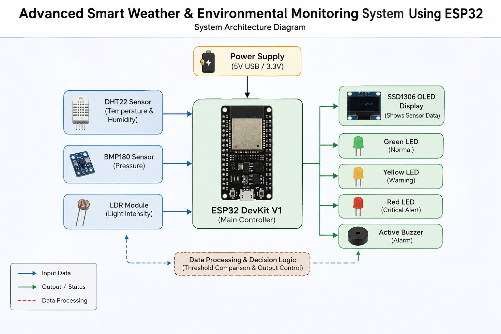
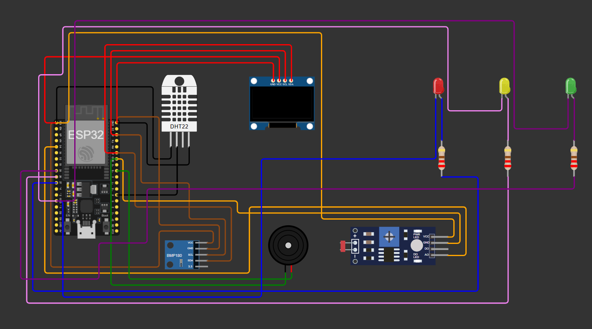
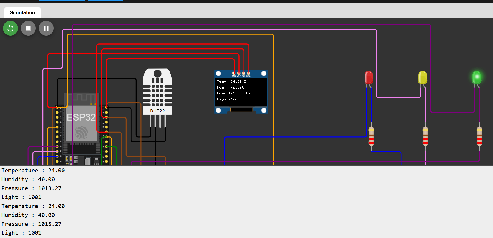
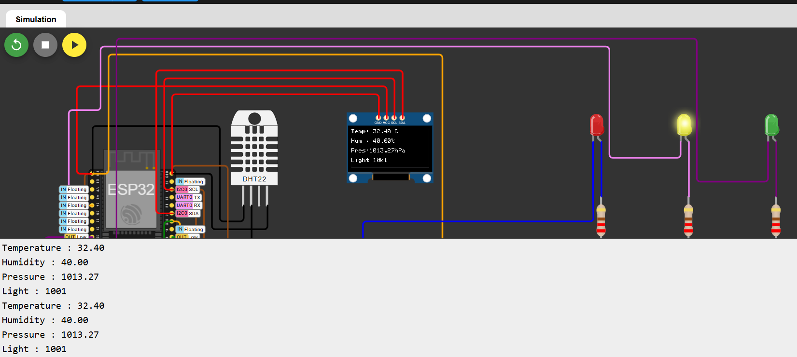
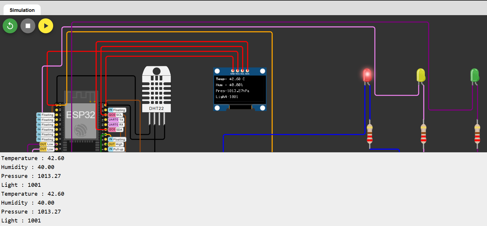

# 🌦️ Advanced Weather & Environmental Monitoring System using ESP32

## 📌 Project Overview

The **Advanced Weather & Environmental Monitoring System** is an ESP32-based embedded systems project designed to monitor environmental conditions in real time. The system continuously measures **temperature**, **humidity**, and **ambient light intensity**, then classifies the surrounding environment into **Normal**, **Moderate Warning**, or **High Temperature Alert** conditions.

Sensor readings and system status are displayed on the Serial Monitor, while LEDs and a buzzer provide visual and audible alerts whenever abnormal environmental conditions are detected.

This project demonstrates real-time environmental monitoring using multiple sensors, making it suitable for smart home, industrial, and educational IoT applications.

---

# 🚀 Project Status

✅ Completed

---

# ✨ Features

- 🌡️ Real-Time Temperature Monitoring
- 💧 Humidity Monitoring
- ☀️ Ambient Light Detection using LDR
- 🚦 Environmental Status Classification
- 🟢 Normal Weather Indication
- 🟡 Moderate Temperature Warning
- 🔴 High Temperature Alert
- 🔔 Buzzer Alert System
- 📟 Serial Monitor Output
- ⚡ ESP32-Based Embedded System

---

# ⭐ Technical Highlights

- Multiple Sensor Integration
- Analog and Digital Signal Processing
- Real-Time Environmental Monitoring
- Embedded C/C++ Programming
- Sensor Data Analysis
- Alert-Based Decision Making
- ESP32 GPIO Programming

---

# 🛠️ Components Used

| Component | Quantity |
|-----------|---------:|
| ESP32 DevKit V1 | 1 |
| DHT22 Temperature & Humidity Sensor | 1 |
| LDR (Photoresistor) | 1 |
| Green LED | 1 |
| Yellow LED | 1 |
| Red LED | 1 |
| Active Buzzer | 1 |
| 220Ω Resistors | 3 |
| Breadboard | 1 |
| Jumper Wires | As Required |

---

# 🔌 Circuit Connections

The project consists of the following hardware modules:

- ESP32 DevKit V1
- DHT22 Temperature & Humidity Sensor
- LDR Sensor
- Green LED
- Yellow LED
- Red LED
- Active Buzzer

The complete wiring connections are provided in the schematic diagram included in this repository.

# 📐 Schematic Diagram

The schematic diagram illustrates the complete electrical connections of the **Advanced Weather & Environmental Monitoring System using ESP32**. It shows how the ESP32 interfaces with the DHT22 temperature and humidity sensor, BMP180 pressure sensor, LDR sensor module, SSD1306 OLED display, status LEDs, and active buzzer. The schematic serves as the hardware blueprint of the project and provides a clear representation of all power, ground, and signal connections.


### Schematic Description

- **ESP32 DevKit V1** acts as the main controller for the entire system.
- **DHT22 Sensor** is connected to measure temperature and humidity.
- **BMP180 Sensor** communicates with the ESP32 through the I²C interface for atmospheric pressure measurement.
- **SSD1306 OLED Display** is connected through the I²C bus to display live environmental data.
- **LDR Sensor Module** measures the surrounding light intensity using an analog input.
- **Green, Yellow, and Red LEDs** provide visual indication of the current environmental condition.
- **Active Buzzer** generates an audible alarm during high-temperature conditions.
- All components share a common **3.3V power supply** and **GND** connections provided by the ESP32.

The schematic provides a complete overview of the hardware design and serves as a reference for assembling and understanding the overall circuit implementation.

# 🏗️ System Architecture

The following figure illustrates the overall architecture of the **Advanced Weather & Environmental Monitoring System using ESP32**. The ESP32 acts as the central controller and continuously acquires environmental data from the connected sensors. Based on the measured values, it processes the sensor data, determines the environmental condition, updates the status indicators, and provides visual and audible alerts.



### Architecture Description

- **ESP32 DevKit V1** serves as the central processing unit of the system.
- **DHT22 Sensor** measures the ambient temperature and humidity.
- **BMP180 Sensor** measures atmospheric pressure.
- **LDR Sensor Module** measures the surrounding light intensity.
- The ESP32 processes all incoming sensor data and compares it with predefined threshold values.
- The **SSD1306 OLED Display** presents real-time sensor readings to the user.
- The **Green LED** indicates normal environmental conditions.
- The **Yellow LED** indicates a moderate temperature warning.
- The **Red LED** indicates a high temperature alert.
- The **Active Buzzer** provides an audible alert during critical environmental conditions.

The system continuously monitors environmental parameters, updates the display with live sensor data, and activates the appropriate indicators to provide real-time environmental monitoring and alert notifications.

---

# ⚙️ Working Principle

1. ESP32 continuously reads temperature and humidity from the DHT22 sensor.
2. The LDR measures the ambient light intensity.
3. Sensor values are displayed on the Serial Monitor.
4. The controller compares the measured values with predefined thresholds.
5. Under normal conditions, the Green LED remains ON.
6. During moderate temperature conditions, the Yellow LED is activated.
7. During high temperature conditions, the Red LED and buzzer are activated to alert the user.
8. The monitoring process repeats continuously in real time.

---

# 📷 Project Gallery

## 🔌 Circuit Design

The complete weather monitoring circuit designed using Wokwi.



---

## 📑 Components List

The detailed hardware components required for this project.

📄 **Download:**  
[Components_List.csv](Components_List.csv)

---

## 💻 Arduino Source Code

The complete ESP32 Arduino program implementing the weather monitoring system.

📄 **Download:**  
[ESP32_Weather_Environmental_Monitoring.ino](ESP32_Weather_Environmental_Monitoring.ino)

---

## 🌤️ Normal Weather Indicator

When the environmental conditions are within the normal operating range, the Green LED remains ON and the Serial Monitor displays the current sensor readings.



---

## 🟡 Moderate Temperature Warning

When the temperature exceeds the normal range, the Yellow LED indicates a moderate warning while the sensor readings continue to be displayed.



---

## 🔴 High Temperature Alert

When the temperature reaches a critical level, the Red LED and buzzer are activated to notify the user of potentially unsafe environmental conditions.



---

# 📚 Technologies Used

- ESP32
- Embedded C/C++
- Arduino IDE
- Wokwi Simulator
- DHT Sensor Library
- GPIO Programming

---

# 📁 Repository Structure

```text
ESP32-Advanced-Weather-Environmental-Monitoring/
│
├── README.md
├── ESP32_Weather_Environmental_Monitoring.ino
├── Diagram.json
├── Circuit_Design.png
├── Components_List.csv
├── Normal_Weather_Indicator.png
├── Moderate_Temperature_Warning.png
├── High_Temperature_Alert.png
└── System_Architecture.png
```

---

# 🎯 Applications

- Smart Weather Monitoring
- Environmental Monitoring Systems
- Smart Home Automation
- Industrial Environment Monitoring
- Educational IoT Projects
- Embedded Systems Learning

---

# 🚀 Future Enhancements

- OLED Display Integration
- Wi-Fi Based Remote Monitoring
- IoT Cloud Dashboard
- Mobile Application Integration
- ThingSpeak Data Logging
- Firebase Cloud Storage
- Email & SMS Alerts
- PCB Design using KiCad

---

# 📄 License

This project is developed for educational and learning purposes.

---

# 👨‍💻 Author

**Shriram Prasanna K**

B.Tech – Electronics and Communication Engineering (ECE)

VIT-AP University
